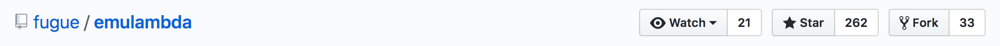

# Welcome!

I maintain this fork of the original **emulambda** repository for CV purposes only. If you are here to see some of my work, please have a look around and use the "blame" feature to see where I'm culpable! Here's what the root repo following looked like in February 2018:

As of February 2018, Fugue announced that [they are no longer maintaining **emulambda**](https://blog.fugue.co/2015-10-29-aws-lambda-emulator.html). If you are using **emulambda** in your build and need some changes, please reach out and I'll see if I can help. If you are looking for an alternative that is actively maintained, I highly recommend [AWS SAM Local](https://github.com/awslabs/aws-sam-local).

Thanks for stopping by! The original README is located in this repo at [README.old.md](./README.old.md).